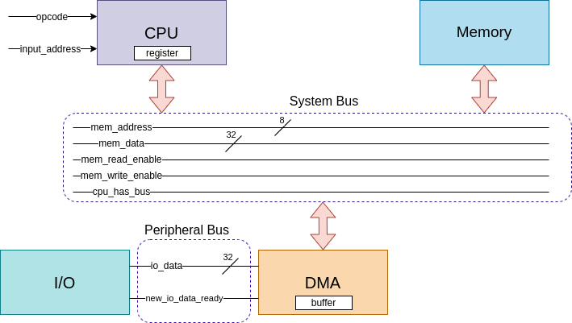

# DMA
A Simple System with Direct Memory Access (DMA) Module (Memory-mapped I/O + Cycle Stealing DMA bus access)

(Assignment of "Interface Circuits Design" Course)

General Architecture:

Full documentation is available [here](Document.pdf).
